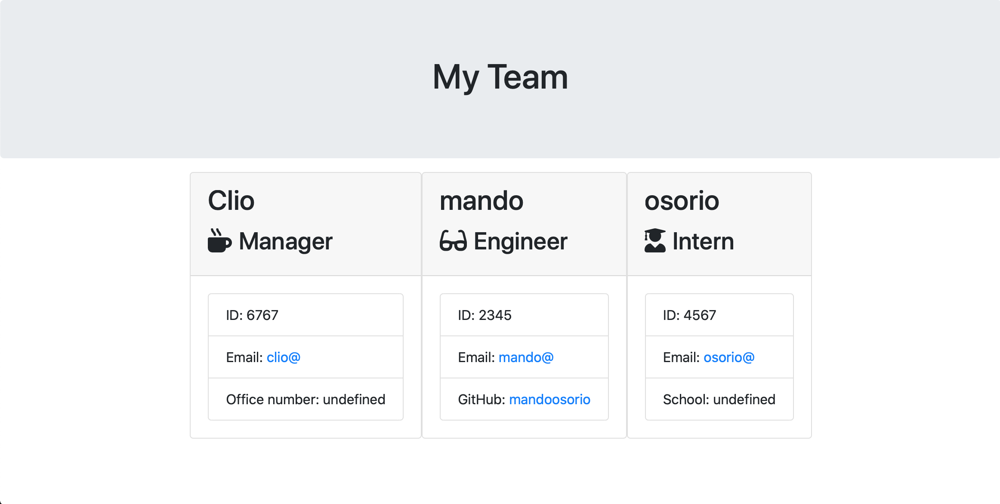

# team_builder

## Description
The application will prompt the user for information about the team manager and then information about the team members. The user can input any number of team members, and they may be a mix of engineers and interns. Once all information is inputed, an html file will be created with pre-made templates.

## Table of Contents
* [Title](#Title)
* [Description](#Description)
* [Installation](#Installation)
* [Usage](#Usage)

## Installation
In order to get started with the application, node.js must be installed and the user will have to run an 'npm install' as well as 'npm install inquirer' in order for the prompts to run. The entirety of this application occurs in the terminal.

## Usage
Open up the terminal, run 'npm install', run 'npm install inquirer', run 'npm install axios', and on the command line once all those tools are installed, type 'node index.js'.

